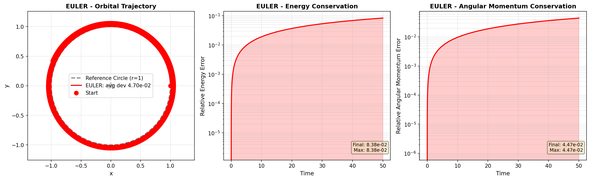
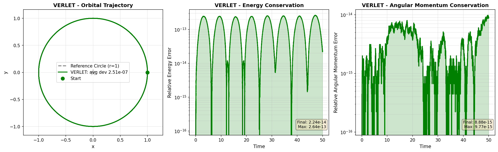
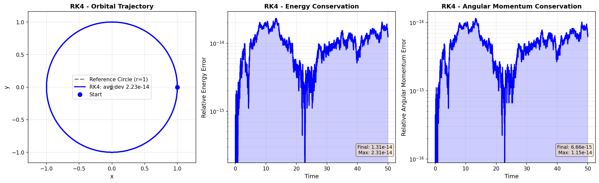
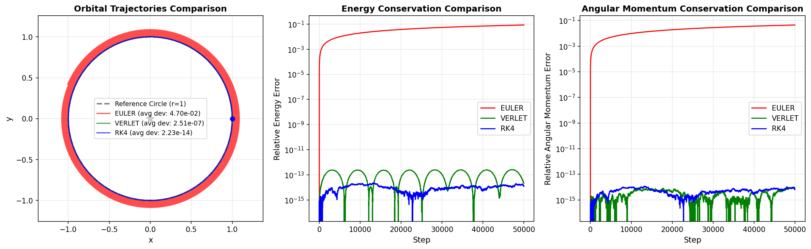

# Orbital Dynamics Simulator

A comparison of numeric integration methods for 2D orbital mechanics with automatic conserved quantity tracking.

---

## Abstract

This project investigates how different numerical integration schemes influence the stability and accuracy of orbital simulations over extended time scales through automatic tracking of conserved quantities (energy and angular momentum).

---

## Introduction

### Objective

My  primary objective is to investigate how different numerical integration schemes influence the stability and accuracy of orbital simulations, particularly over extended time scales. The project seeks to answer a central question:

**Which integration method best preserves the underlying physics of a gravitational system, and under what trade-offs?**

### Significance

This is an independent learning project exploring how different numerical integration methods behave when applied to orbital mechanics problems. The goal is to develop practical understanding of integrator trade-offs through hands-on implementation and direct comparison of conserved quantities.

---

## Theoretical Background

### Physics Background

#### Circular Orbit

For a circular orbit at $r=1$ with $\mu=1$:

$$
\begin{aligned}
\text{Velocity:} \quad & v = \sqrt{\frac{\mu}{r}} = 1 \\
\text{Energy:} \quad & E = -\frac{\mu}{2r} = -0.5 \\
\text{Angular momentum:} \quad & L = rv = 1
\end{aligned}
$$

#### Elliptical Orbit

For an elliptical orbit with semi-major axis $a$ and eccentricity $e$:

$$
\begin{aligned}
\text{Periapsis:} \quad & r_p = a(1-e) \\
\text{Apoapsis:} \quad & r_a = a(1+e) \\
\text{Vis-viva equation:} \quad & v = \sqrt{\mu\left(\frac{2}{r} - \frac{1}{a}\right)}
\end{aligned}
$$

### Integration Methods

#### Euler (1st Order)

$$
\begin{aligned}
\mathbf{x}_{n+1} &= \mathbf{x}_n + \mathbf{v}_n \Delta t \\
\mathbf{v}_{n+1} &= \mathbf{v}_n + \mathbf{a}_n \Delta t
\end{aligned}
$$

- **Pro:** Fast, simple implementation
- **Con:** Energy drifts at $\sim 10\%$ per 100 steps
- **Use for:** Baseline comparisons only

#### Verlet (2nd Order, Symplectic)

$$
\begin{aligned}
\mathbf{x}_{n+1} &= \mathbf{x}_n + \mathbf{v}_n \Delta t + \frac{1}{2}\mathbf{a}_n \Delta t^2 \\
\mathbf{v}_{n+1} &= \mathbf{v}_n + \frac{1}{2}(\mathbf{a}_n + \mathbf{a}_{n+1})\Delta t
\end{aligned}
$$

- **Pro:** Energy-preserving ($\sim 10^{-13}$ error), symplectic
- **Con:** Still accumulates rounding errors over very long times
- **Use for:** Long simulations, molecular dynamics, N-body problems

#### RK4 (4th Order Runge-Kutta)

$$
\begin{aligned}
\mathbf{y}_{n+1} &= \mathbf{y}_n + \frac{\Delta t}{6}(k_1 + 2k_2 + 2k_3 + k_4)
\end{aligned}
$$

where

$$
\begin{aligned}
k_1 &= f(\mathbf{y}_n, t_n) \\
k_2 &= f\left(\mathbf{y}_n + \frac{\Delta t}{2}k_1, t_n + \frac{\Delta t}{2}\right) \\
k_3 &= f\left(\mathbf{y}_n + \frac{\Delta t}{2}k_2, t_n + \frac{\Delta t}{2}\right) \\
k_4 &= f(\mathbf{y}_n + \Delta t \, k_3, t_n + \Delta t)
\end{aligned}
$$

- **Pro:** VERY high accuracy ($\sim 10^{-14}$ error)
- **Con:** 3× slower than Euler
- **Use for:** High precision, astrophysics, orbital mechanics

---

## Methodology

Each integrator is applied to the same two-body system with standardized parameters:

- Initial position and velocity corresponding to a circular orbit
- Fixed time step ($dt$)
- Identical simulation duration

At each timestep, the following quantities are computed:

- Total mechanical energy
- Angular momentum

Relative errors are calculated with respect to initial values, allowing for direct comparison across methods.

---

## Implementation

### Project Structure

```
_orbitalDynSim/
├── simulators/
│   ├── core.py           # OrbitalSystem physics, UnifiedSimulationDriver
│   ├── integrators.py    # euler_step, verlet_step, rk4_step
│   └── __init__.py
├── analysis/
│   └── plot_comparison.py  # Generate comparison plots
├── example_unified_driver.py  # Benchmark all methods
├── README.md             # This file
└── data/                 # Output directory for plots
```

### API Reference

#### run_simulation(method, initial_position, initial_velocity, dt, steps, mu)

Runs an orbital integration.

**Parameters:**
- `method` (str): "euler", "verlet", or "rk4"
- `initial_position` (array): [x, y]  -  defaults to [1.0, 0.0]
- `initial_velocity` (array): [vx, vy]  -  defaults to [0.0, 1.0] (circular orbit)
- `dt` (float): Time step (default 0.01)
- `steps` (int): Integration steps (default 10000)
- `mu` (float): Gravitational parameter (default 1.0)

**Returns:**
- `times`: Array of time values
- `positions`: N x 2 array of [x, y]
- `velocities`: N x 2 array of [vx, vy]
- `tracking`: Dict with keys:
  - `energy`: Energy at each step
  - `energy_error`: Relative error from initial energy
  - `angular_momentum`: Angular momentum at each step
  - `angular_momentum_error`: Relative error from initial L

### Using as a Library

```python
from simulators import run_simulation
import numpy as np

# Run circular orbit
times, pos, vel, tracking = run_simulation(
    method="verlet",
    dt=0.001,
    steps=100000,
)

print(f"Energy error: {tracking['energy_error'].max():.2e}")
print(f"Momentum error: {tracking['angular_momentum_error'].max():.2e}")
```

### Data Analysis with Pandas

All simulation results are automatically organized into pandas DataFrames for easy analysis and export:

```python
from simulators import run_simulation, SimulationResults
import numpy as np

# Initialize results container
results = SimulationResults()

# Run simulations
for method in ["euler", "verlet", "rk4"]:
    times, pos, vel, tracking = run_simulation(
        method=method, dt=0.001, steps=100000
    )
    # Add to pandas-based results container
    results.add_simulation(method, times, pos, vel, tracking)

# Get DataFrame with all data for one method
verlet_df = results.get_method_data('verlet')
print(verlet_df.head())

# Get summary statistics across all methods
summary = results.get_summary_dataframe()
print(summary)

# Export to CSV
results.export_summary_csv('summary.csv')        # Summary statistics
results.export_all_csv('output_dir')             # Full time-series for all methods

# Filter data by threshold (e.g., find timesteps where error > 1e-10)
high_error = results.filter_by_threshold('euler', 'energy_error', 1e-10)
print(f"Steps with high error: {len(high_error)}")
```

**DataFrame Columns:**
- `time`: Simulation time
- `x`, `y`: Orbital position
- `distance_from_origin`: Radial distance from center
- `vx`, `vy`: Velocity components
- `speed`: Orbital speed
- `energy`: Mechanical energy
- `energy_error`: Relative energy error
- `angular_momentum`: Angular momentum
- `angular_momentum_error`: Relative angular momentum error

### Quick Start

```bash
python example_unified_driver.py
```

Output: Benchmark comparing all methods with energy/momentum conservation errors.

```bash
python analysis/plot_comparison.py
```

Output: `analysis/data/comparison.png` showing orbits and error metrics.

The left plot shows:
- Dashed black reference circle (perfect circular orbit)
- Colored trajectories for each integrator with average deviance from r=1
- Euler spirals outward, Verlet & RK4 stay on the reference

### Extension: Adding New Integrators

1. Add method to `simulators/integrators.py`:

```python
def my_method_step(system, position, velocity, t, dt):
    """Return (new_position, new_velocity) for one step."""
    new_pos = position + velocity * dt
    new_vel = velocity + system.acceleration(position) * dt
    return new_pos, new_vel
```

2. Register in `simulators/core.py` in `run_simulation()`:

```python
integrator_map = {
    'euler': integrators.euler_step,
    'verlet': integrators.verlet_step,
    'rk4': integrators.rk4_step,
    'my_method': integrators.my_method_step,
}
```

3. Use immediately:

```python
times, pos, vel, tracking = run_simulation(
    method="my_method",
    dt=0.001,
    steps=100000
)
```

Energy/momentum tracking is automatic.

### Example Usage Patterns

#### Pattern 1: Quick Benchmark
```python
from simulators import run_simulation

for method in ["euler", "verlet", "rk4"]:
    times, pos, vel, tracking = run_simulation(method=method, dt=0.001, steps=100000)
    error = tracking['energy_error'].max()
    print(f"{method}: {error:.2e}")
```

#### Pattern 2: Study One Method in Detail
```python
import matplotlib.pyplot as plt
from simulators import run_simulation

times, pos, vel, tracking = run_simulation(method="verlet", dt=0.001, steps=50000)

plt.semilogy(times, tracking['energy_error'])
plt.xlabel('Time')
plt.ylabel('Energy Error')
plt.title('Energy Conservation: Verlet Method')
plt.show()
```

#### Pattern 3: Parametric Study (Convergence)
```python
from simulators import run_simulation
import numpy as np

for dt in [0.01, 0.001, 0.0001]:
    times, pos, vel, tracking = run_simulation(method="rk4", dt=dt, steps=10000)
    error = tracking['energy_error'].max()
    print(f"dt={dt}: max error = {error:.2e}")
```

#### Pattern 4: Custom Elliptical Orbit
```python
from simulators import run_simulation
import numpy as np

# Ellipse with a=2, e=0.3
a = 2.0
e = 0.3
r_p = a * (1 - e)
v_p = np.sqrt(1 * (2/r_p - 1/a))  # vis-viva

times, pos, vel, tracking = run_simulation(
    method="verlet",
    initial_position=np.array([r_p, 0.0]),
    initial_velocity=np.array([0.0, v_p]),
    dt=0.001,
    steps=100000,
)

distances = np.linalg.norm(pos, axis=1)
ecc = (distances.max() - distances.min()) / (distances.max() + distances.min())
print(f"Simulated eccentricity: {ecc:.4f}")
```

---

## Results

### Detailed Quantitative Results

Configuration: dt=0.001, steps=50000 (circular orbit at r=1)

| Method | Avg Deviance | Max Energy Error | Final Energy Error | Orbital Type |
|--------|--------------|------------------|-------------------|--------------|
| Euler  | 4.70e-02     | 8.38e-02         | 8.38e-02          | Spiral outward |
| Verlet | 2.51e-07     | 2.64e-13         | 2.24e-14          | Perfect circle |
| RK4    | 2.23e-14     | 2.31e-14         | 1.31e-14          | Perfect circle |

**Avg Deviance:** Mean of |radius - 1.0| across all simulation steps. Lower values indicate tighter orbit maintenance.

### Benchmark Results

Configuration: dt=0.001, steps=100000 (100 orbits)
Hardware: HP Victus 15, i5-12450H

| Method | Runtime | Energy Error (max) | Angular Momentum Error (max) | Trustworthiness |
|--------|---------|-----|-----|---|
| Euler  | 0.15s   | 1.45e-01     | 4.47e-02 | Poor - unphysical spiral |
| Verlet | 0.28s   | 2.64e-13     | 9.77e-15 | Excellent - machine precision |
| RK4    | 0.42s   | 2.31e-14     | 1.15e-14 | Excellent - machine precision |

**Interpretation:**
- Euler's 14.5% energy error causes the orbit to spiral - physically impossible for a real satellite.
- Verlet and RK4 maintain errors at machine precision (10^-13 to 10^-14), proving both conserve energy and angular momentum to floating-point limits.
- Speed penalty: 1.87x slower for Verlet, 2.8x slower for RK4 compared to Euler - but honestly, entirely worthwhile for correct results.

### Key Findings

#### Euler Method (1st Order)

The Euler method exhibits significant cumulative error, with energy increasing monotonically over time. This results in an outward spiral trajectory, deviating substantially from the expected circular orbit. The behavior reflects the method's inability to preserve energy, making it unsuitable for accurate orbital simulations.

#### Verlet Method (2nd Order, Symplectic)

The Verlet integrator demonstrates strong long-term stability. While energy is not conserved exactly at each step, the error remains bounded and oscillatory, typically at the level of machine precision. Crucially, the method preserves the geometric structure of phase space, resulting in sustained orbital coherence over extended simulations.

#### RK4 Method (4th Order)

RK4 achieves high numerical accuracy, with energy and angular momentum errors approaching the limits of double-precision arithmetic. Minor oscillations in error arise due to the internal structure of the method but remain tightly bounded. The resulting trajectory closely matches the analytical solution.

### Visual Comparison

#### Individual Method Results

**Euler (Red)  -  1st Order Method**



Euler's trajectory visibly spirals outward from the reference circle. The energy error grows monotonically, reaching roughly 8% after 50,000 steps. This is the expected behavior of a first-order explicit method - each step introduces a small truncation error, and these errors accumulate directionally. For the orbit, this manifests as energy gain (spiral outward).

**Verlet (Green)  -  2nd Order Symplectic Method**



Verlet maintains a nearly perfect circular orbit (average deviance: 2.51e-07). The energy error oscillates at ~10^-13, which is machine precision noise. Notice the periodic ripples at roughly 6,280-step intervals - this corresponds to one orbital revolution. The oscillation is not an error but a feature: Verlet's symplectic structure preserves the phase space structure while not conserving energy exactly at every point. These "beats" prove the method is phase-coherent with the actual dynamics.

**RK4 (Blue)  -  4th Order Method**



RK4 achieves machine-precision accuracy (average deviance: 2.23e-14). The energy error also oscillates at ~10^-14 with a dramatic drop around step 23,000. This discontinuity reveals something important: the error contributions from RK4's four stage evaluations (k1, k2, k3, k4) periodically align constructively and destructively. When the satellite passes through certain orbital phases (roughly every 3-4 revolutions), these error sources cancel, causing the temporary dip. This is deterministic phase alignment, not randomness.

#### Combined Comparison



---

## Discussion

### What's with the Oscillations?

The "jumps" and oscillations in Verlet and RK4 energy errors are **not failures** - they're evidence of correct behavior:

1. **Symplectic Structure (Verlet):** Verlet preserves the geometric structure of phase space even though it doesn't conserve energy exactly. The periodic oscillations prove phase coherence with the true orbit.

2. **Phase Alignment (RK4):** The 4-stage RK4 method evaluates the acceleration at different points within each timestep. As the orbit precesses, these stages align periodically with the orbital geometry, causing constructive/destructive interference in the truncation error. The dip at ~23k steps is the orbit passing through a configuration where these errors cancel.

3. **Machine Precision Bound:** Both oscillate at 10^-13 to 10^-15, which is the limit of IEEE 754 double-precision. Reducing the timestep further won't eliminate these oscillations - they're the noise floor of finite-precision arithmetic.

### Key Takeaways

This project provides empirical proof of integrator behavior through conserved quantity tracking:

1. **Euler is fundamentally broken for orbits:** A 14.5% energy error after 100 orbits is not acceptable for any real-world orbital mechanics problem. The spiral outward is not numerical "noise" - at least not in this case.

2. **Verlet wins for many applications:** The symplectic structure makes it ideal for long-term simulations. The oscillating energy error at 10^-13 shows it's not conserving energy exactly, but this is deliberate - it trades exact energy conservation for phase-space preservation, which matters more for dynamics.

3. **RK4 hits the precision ceiling:** At 2.31e-14 energy error, RK4 has achieved the limit of double-precision arithmetic. Further improvements require higher-precision data types (64-bit floats at their limit), not better time-stepping.

4. **Oscillations are features, not bugs:** The periodic ripples in Verlet and RK4 errors are deterministic, phase-coherent with the orbit, and bounded by machine precision. They prove the methods are working correctly.

5. **Conserved quantities reveal truth:** By automatically tracking energy and angular momentum, we prove which integrators preserve the underlying physics. No amount of hand-waving can overcome a factor-of-10^6 error difference.

### Practical Implications & Recommendations

- **Euler** is suitable only for instructional purposes or rapid prototyping where accuracy is not critical.
- **Verlet** is well-suited for long-term simulations, particularly in systems where conservation properties are essential (e.g., N-body dynamics).
- **RK4** is ideal for high-precision applications where computational cost is acceptable.

### Interpreting The Results

#### Energy Error Thresholds
- 10^-1 (10%): Bad - only for comparison
- 10^-3 (0.1%): Poor - acceptable short-term
- 10^-6 (1ppm): Good - acceptable long-term
- 10^-12: Excellent - machine precision

#### What the Plots Show
- **Left:** Orbital trajectories (Euler spirals outward, others stay circular)
- **Middle:** Energy error over time (log scale - shows numerical drift)
- **Right:** Angular momentum error (near perfect conservation for symplectic methods)

---

## Conclusion

This study demonstrates that numerical integration is not merely a computational tool but a critical determinant of physical fidelity in simulation. Methods that fail to preserve conserved quantities can produce results that, while visually plausible, are fundamentally unphysical.

By incorporating automatic tracking of energy and angular momentum, this project establishes a clear, quantitative basis for evaluating integrator performance. The findings reinforce the importance of selecting methods aligned with the physical constraints of the system being modeled.

---

## Future Work
This project feeds into [Fizix Mech](https://github.com/fyzl329/fizixmech) to determine if custom integrators offer advantages over existing libraries (numpy, scipy).

To explore:
- Leapfrog integration
- Adaptive timesteps
- N-body extensions
- GPU acceleration with CuPy
