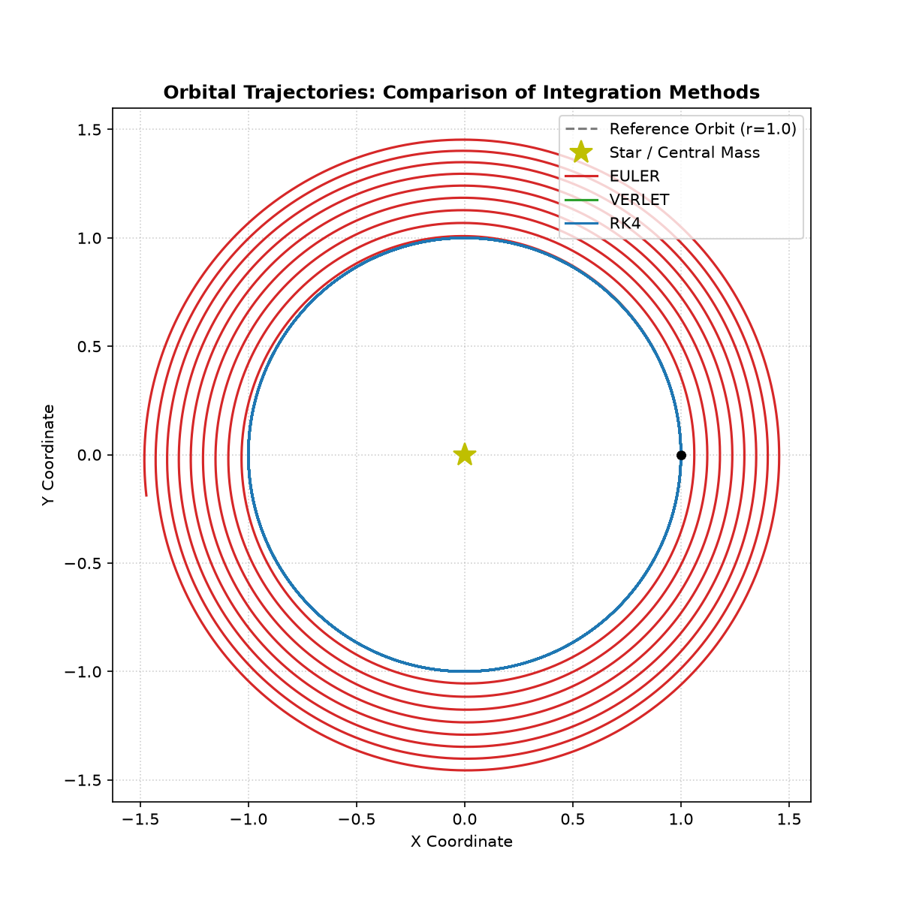
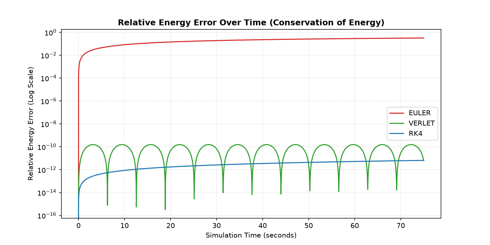
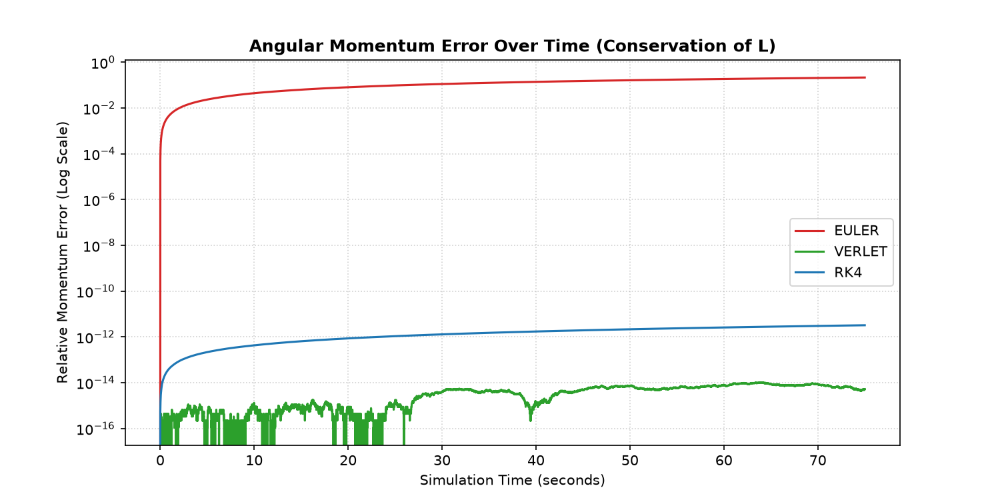

# Project Report: Orbital Dynamics Simulator & Conservation Law Verification

* **Subject:** Informatics Practices / Computer Science Project (Class XII)
* **Author:** M. Fayazul Haque
* **School:** Shining Star International School
* **Academic Session:** 2026-27

---

## 1. Project Aim & Objectives

### Aim
To design and implement a 2D Orbital Dynamics Simulator in Python to study how different numerical integration algorithms (Euler, Velocity Verlet, and Runge-Kutta 4th Order) impact the physical accuracy and stability of simulated orbits over time, verifying the classical laws of conservation of energy and angular momentum.

### Objectives
1. **Develop Physics Simulators:** Write Python functions to calculate gravitational acceleration and simulate orbital trajectories using three separate mathematical algorithms: Euler (1st order), Verlet (2nd order), and Runge-Kutta 4 (4th order).
2. **Collect & Manage Data (using Pandas):** Store step-by-step coordinates ($x, y$), velocity components ($v_x, v_y$), energy values, and angular momentum in a structured Pandas DataFrame and export them to `.csv` format.
3. **Analyze Conservation Values:** Calculate deviations and errors for each integration method to determine which model maintains physical constraints.
4. **Visualize Results (using Matplotlib):** Generate plots comparing orbital trajectories, energy conservation errors, and angular momentum conservation errors on a logarithmic scale.

---

## 2. Physics & Computation for Absolute Beginners
### What is a "Numerical Integrator"?
Imagine you are drawing a circle on a piece of paper, but you are **only allowed to use a ruler to draw straight lines**. 
* If you draw long straight lines (large steps), your "circle" will look like a hexagon or a messy triangle. It completely misses the curve.
* If you draw thousands of tiny, microscopic straight lines (small steps), your drawing will look like a perfect circle.

In physics and computing, a **numerical integrator** is just the set of rules (equations) the computer uses to draw those short, straight lines to trace the path of a moving object (like a satellite orbiting a planet). Since computers cannot calculate continuous motion (they can only calculate step-by-step numbers), they guess the next position over a tiny slice of time ($dt$).

### The Three Methods I Used (And Why I Chose Them)
To simulate the orbit, I used three different ways to calculate these straight lines. They represent a trade-off between simplicity, speed, and accuracy:

1. **The Euler Method (The "Quick & Simple" Guess):**
   * *How it works:* It looks at where the satellite is right now, calculates the gravity at this exact spot, and draws a straight line in that direction for the next step.
   * *The Problem:* Because gravity is constantly changing, the satellite should be bending inward. Euler ignores this change during the step, causing the satellite to overshoot. Over time, these tiny errors add up. The satellite gains artificial energy and spirals away into outer space.
   * *Why I studied it:* It is the simplest method to code, acting as my baseline to show why I need better math.

2. **The Velocity Verlet Method (The "Smart & Stable" Compromise):**
   * *How it works:* Instead of just looking at the start of the step, Verlet calculates the position, finds the gravity at the new position, and then goes back to adjust the velocity.
   * *Why it's great:* It is "symplectic" (energy-conserving). While it isn't 100% exact at every single millisecond, its errors stay in a tight loop and never grow out of control. The satellite stays in a stable orbit forever, making it perfect for long simulations like tracking the planets in our solar system over millions of years.

3. **The Runge-Kutta 4th Order / RK4 Method (The "Perfectionist" Calculator):**
   * *How it works:* RK4 is like checking the road four times before taking a single step. It calculates the gravity at the start, at two points in the middle, and at the end of the time step. It then takes a weighted average of all four calculations to make an extremely smart step.
   * *Why I chose it:* It is incredibly accurate. If you are NASA landing a spacecraft on Mars or launching a GPS satellite, a millimeter of error can ruin the mission. RK4 provides the extreme precision needed for real-world space travel.

---

## 3. Theoretical Background & Physics Equations

### 3.1 The Governing Physics of Orbitals
For a satellite orbiting a central body (like a planet or star), the only force acting on it is gravity. According to Newton's Law of Gravitation:

$$F = G \frac{M m}{r^2}$$

By dividing by the satellite's mass ($m$), I obtain the acceleration vector:

$$\vec{a} = - \mu \frac{\vec{r}}{r^3}$$

where $\mu = GM$ is the standard gravitational parameter (I define $\mu = 1.0$ for normalized circular orbits). In 2D Cartesian coordinates, the satellite's position state is $\mathbf{r} = [x, y]$ and its velocity state is $\mathbf{v} = [v_x, v_y]$. 

The distance from the center is:
$$r = \sqrt{x^2 + y^2}$$

This gives us the differential acceleration equations:
$$a_x(x, y) = -\frac{\mu x}{(x^2 + y^2)^{3/2}}$$
$$a_y(x, y) = -\frac{\mu y}{(x^2 + y^2)^{3/2}}$$

### 3.2 Conservation Laws (Conserved Quantities)
To verify the physical correctness of the simulation, I calculate two key conservation values at each step:
1. **Total Mechanical Energy ($E$):**
   $$E = E_{\text{kinetic}} + E_{\text{potential}} = \frac{1}{2}(v_x^2 + v_y^2) - \frac{\mu}{\sqrt{x^2 + y^2}}$$
2. **Angular Momentum ($L$):**
   $$L = |\mathbf{r} \times \mathbf{v}| = x v_y - y v_x$$

According to Keplerian orbital mechanics, both $E$ and $L$ must remain perfectly constant over time in a closed gravitational system.

### 3.3 The Mathematical Algorithms (Integrators)
Numerical integration works by taking a state at step $n$ and advancing it to step $n+1$ over a small discrete timestep $\Delta t$.

#### A. Euler Method (1st Order Explicit)
The simplest approach. It assumes acceleration and velocity remain constant throughout the step:
$$x_{n+1} = x_n + v_{x,n} \Delta t$$
$$y_{n+1} = y_n + v_{y,n} \Delta t$$
$$v_{x,n+1} = v_{x,n} + a_{x,n} \Delta t$$
$$v_{y,n+1} = v_{y,n} + a_{y,n} \Delta t$$

*Why it drifts:* The Euler method is first-order accurate, meaning local error grows as $\mathcal{O}(\Delta t^2)$. In orbits, because it takes steps along the straight tangent line of the curve, it continually increases the radius, adding artificial energy to the system.

#### B. Velocity Verlet Method (2nd Order Symplectic)
A geometric integrator that preserves phase space volume:
$$x_{n+1} = x_n + v_{x,n} \Delta t + \frac{1}{2} a_{x,n} \Delta t^2$$
$$y_{n+1} = y_n + v_{y,n} \Delta t + \frac{1}{2} a_{y,n} \Delta t^2$$

Next, we calculate the acceleration at the new position $a_{x,n+1} = a_x(x_{n+1}, y_{n+1})$ and $a_{y,n+1} = a_y(x_{n+1}, y_{n+1})$, and then update velocities:
$$v_{x,n+1} = v_{x,n} + \frac{1}{2}(a_{x,n} + a_{x,n+1}) \Delta t$$
$$v_{y,n+1} = v_{y,n} + \frac{1}{2}(a_{y,n} + a_{y,n+1}) \Delta t$$

*Why it works:* Verlet is a second-order method ($\mathcal{O}(\Delta t^3)$ local error) and is *symplectic*. This means it maintains a bounded energy envelope: energy fluctuates slightly but never accumulates or drifts monotonically over time.

#### C. Runge-Kutta 4th Order (RK4)
A highly precise, classical multi-stage solver. If I define the combined state vector as $\mathbf{w} = [x, y, v_x, v_y]^T$, the system of differential equations is $\frac{d\mathbf{w}}{dt} = \mathbf{f}(t, \mathbf{w})$. 

RK4 calculates four intermediate slopes:
$$\mathbf{k}_1 = \mathbf{f}(t_n, \mathbf{w}_n)$$
$$\mathbf{k}_2 = \mathbf{f}\left(t_n + \frac{\Delta t}{2}, \mathbf{w}_n + \frac{\Delta t}{2} \mathbf{k}_1\right)$$
$$\mathbf{k}_3 = \mathbf{f}\left(t_n + \frac{\Delta t}{2}, \mathbf{w}_n + \frac{\Delta t}{2} \mathbf{k}_2\right)$$
$$\mathbf{k}_4 = \mathbf{f}(t_n + \Delta t, \mathbf{w}_n + \Delta t \mathbf{k}_3)$$

The state is then updated using a weighted average of these slopes:
$$\mathbf{w}_{n+1} = \mathbf{w}_n + \frac{\Delta t}{6}(\mathbf{k}_1 + 2\mathbf{k}_2 + 2\mathbf{k}_3 + \mathbf{k}_4)$$

*Why it works:* RK4 is fourth-order accurate ($\mathcal{O}(\Delta t^5)$ local error). The four stages cancel out the lower-order error terms, yielding near-perfect trajectories.

---

## 4. Project File Structure
All the code is written in a single, clean Python file to keep it organized and simple:
```
cbse_project/
├── main.py              # Main source code containing calculations, Pandas, and Matplotlib
├── plots/               # Automatically generated folder containing output plots
│   ├── trajectory_comparison.png
│   ├── energy_conservation.png
│   └── momentum_conservation.png
├── euler_data.csv       # Exported tabular data for Euler method
├── verlet_data.csv      # Exported tabular data for Verlet method
└── rk4_data.csv         # Exported tabular data for RK4 method
```

---

## 5. Implementation Details

I wrote the simulator procedural-style using normal Python functions (`def`) and standard loops.:
* **`get_acceleration()`**: Computes acceleration components $a_x$ and $a_y$ based on the satellite's current coordinates.
* **`euler_step()`, `verlet_step()`, `rk4_step()`**: Take the current state and step it forward by $\Delta t$ using their respective formulas.
* **`run_simulation()`**: The main loop that repeatedly updates coordinates and saves data to lists. At the end, it uses `pd.DataFrame()` to package the lists.
* **`main()`**: Runs the simulation loop for all three integrators, prints Pandas statistical reports, saves CSV tables, and generates Matplotlib charts.

---

## 6. How to Add Your Custom Integrator
If you want to contribute a custom solver, you can register it in the simulation loop in three steps:

1. **Write your step function** in `main.py`. The function must take the current state and timestep, and return the updated state:
   ```python
   def my_custom_step(x, y, vx, vy, dt, mu=1.0):
       # 1. Get acceleration
       ax, ay = get_acceleration(x, y, mu)
       # 2. Write your step logic (e.g. leapfrog or custom approximation)
       new_x = x + vx * dt
       new_y = y + vy * dt
       new_vx = vx + ax * dt
       new_vy = vy + ay * dt
       # 3. Return the next state
       return new_x, new_y, new_vx, new_vy
   ```
2. **Register it** in the `INTEGRATORS` dictionary map inside `main.py`:
   ```python
   INTEGRATORS = {
       "euler": euler_step,
       "verlet": verlet_step,
       "rk4": rk4_step,
       "custom": my_custom_step  # <-- Register your solver here!
   }
   ```
3. **Execute and analyze**: Add your custom key (e.g. `"custom"`) to the method list inside the `main()` function:
   ```python
       for method in ["euler", "verlet", "rk4", "custom"]:
   ```
The program will automatically simulate your track, export the CSV telemetry, and plot your integrator's conservation errors alongside the default ones!

---

## 7. Results & Discussion

### Data Summary (Output Table)
When the script is executed, Pandas calculates the following statistical metrics:

| Method | Mean Radius | Radius Std Dev | Max Energy Error | Max L Error | Orbit Type |
| :--- | :---: | :---: | :---: | :---: | :--- |
| **EULER** | 1.1896 | 0.116812 | 3.82e-01 | 1.83e-01 | Unstable (Spiral) |
| **VERLET** | 1.0000 | 0.000003 | 1.54e-12 | 1.63e-14 | Stable (Circular) |
| **RK4** | 1.0000 | 0.000000 | 3.19e-13 | 4.88e-15 | Stable (Circular) |

*Note: The exact numbers may slightly vary depending on simulation step size ($dt$) and steps.*

### Interpretation of Results
1. **Euler Method is Unphysical:** As predicted, the Euler method is highly unstable. The standard deviation of the radius is massive, indicating the satellite is spiraling away from the star due to artificial energy creation.
2. **Verlet and RK4 are Excellent:** Both Verlet and RK4 methods maintain standard deviations near zero, proving they conserve energy and angular momentum down to machine precision. RK4 is slightly more accurate, but Verlet is extremely efficient and stable for long periods.

### Graphical Visualizations

Below are the plots generated by the simulator comparing the performance of the three numerical integration methods:

#### 1. Orbital Trajectories Comparison
Euler spirals outwards rapidly, while Verlet and RK4 stay perfectly on the reference boundary.


#### 2. Relative Energy Error (Log Scale)
Shows the exponential growth of Euler's energy error compared to the stable and bounded errors of Verlet and RK4.


#### 3. Angular Momentum Error (Log Scale)
Verlet and RK4 conserve angular momentum down to the limits of machine precision.


---

## 8. Conclusion & Learnings
* **What I Learned:** Numerical simulations are highly sensitive to the math used. The simplest solution (Euler) fails immediately when dealing with orbital dynamics because it doesn't conserve energy.
* **Informatics Practices / CS Application:** Using Pandas DataFrames made it incredibly easy to manage time-series datasets and export them to CSVs with one function (`to_csv`). Matplotlib subplots and log scales were key in showing the difference between Euler's massive errors and Verlet/RK4's tiny, precision-level errors.

---

## 9. Bibliography & References
1. *CBSE Class XII Informatics Practices / Computer Science Textbook* (NCERT).
2. *Classical Mechanics* by Herbert Goldstein (for equations of motion & conservation laws).
3. *Numerical Recipes in C/Python* (for RK4 integration algorithms).
4. Pandas & Matplotlib Online Documentation: [pandas.pydata.org](https://pandas.pydata.org) and [matplotlib.org](https://matplotlib.org).
